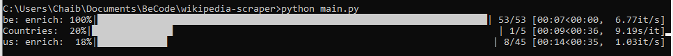
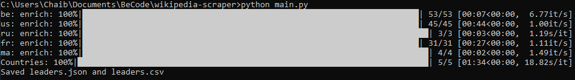

# Wikipedia Scraper
[](https://www.python.org/)

A robust Python scraper to retrieve world leaders’ data via the Country-Leaders API and enrich it with Wikipedia introductions.


---

## Description  

`WikipediaScraper` is a modular, class-based web scraper that:  
- Connects to the public **Country-Leaders [API](https://country-leaders.onrender.com/docs)**  
- Retrieves historical leaders for supported countries  
- Scrapes each leader’s **Wikipedia introduction** (multi-language support)  
- Cleans and sanitizes data with regex  
- Saves results in **JSON and CSV formats**  
- Features a **progress bar** and **parallel scraping** for efficiency  
- Handles **automatic cookie refresh** and **graceful API failures**  

The project structure is designed for scalability, modularity, and clarity.


---

## Project Structure  

```
wikipedia-scraper/
│
├── main.py                        # Entry point to run the scraper
├── src/
│   ├── __init__.py
│   ├── leaders_scraper.py         # Main WikipediaScraper class
├── utils/
│       ├── __init__.py
│       └── helpers.py             # Helper utilities (regex, tqdm wrappers)
├── images/
│       ├── 
│       └── 
├── leaders_data.json              # Output: Json leader data
├── leaders_data.csv               # Output: CSV version
└── README.md
```

---

## Installation  

### Clone the repository  
```bash
git clone https://github.com/AmineSam/wikipedia-scraper.git
cd wikipedia-scraper
```

### Create and activate a virtual environment  
```bash
python -m venv .venv
source .venv/bin/activate  # On Windows: .venv\Scripts\activate
```

### Install dependencies  
```bash
pip install -r requirements.txt
```

---

## Usage  

### Run the scraper:
```bash
python main.py
```

### Example output:



### After completion:
- A `leaders_data.json` file is created with full leader profiles.
- A `leaders_data.csv` file is also generated for spreadsheet use.

---

## Visuals  

### Example Console Output:



### Example JSON Structure:
```json
{
  "us": [
    {
      "id": "Q91",
      "first_name": "Abraham",
      "last_name": "Lincoln",
      "birth_date": "1809-02-12",
      "death_date": "1865-04-15",
      "place_of_birth": "Sinking Spring Farm",
      "wikipedia_url": "https://en.wikipedia.org/wiki/Abraham_Lincoln",
      "start_mandate": "1861-03-04",
      "end_mandate": "1865-04-15",
      "first_paragraph": "Abraham Lincoln (February 12 1809 – April 15 1865) was the 16th president of the United States serving from 1861 until his assassination in 1865. He led the United States through the American Civil War defeating the Confederate States and playing a major role in the abolition of slavery."
    }
  ]
}
```

---

## Features  

**Architecture**  
- Class-based modular design (`WikipediaScraper` class)  
- Clear folder separation (`src/`, `utils/`, `main.py`)  

**Performance Enhancements**  
- Parallel Wikipedia scraping with `ThreadPoolExecutor`  
- Single `requests.Session()` reused for efficiency  

**Reliability**  
- Automatic cookie refresh when API cookie expires  
- Graceful exception handling (no data loss)  

**Clean Output**  
- Regex sanitization removes HTML, footnotes, phonetics and unwanted text or emoji 
- Saves both JSON and CSV formats  

**UX**  
- Single global progress bar for fetching progress  

---

## Future Enhancements  

- Add asynchronous scraping with `aiohttp`
- Add CLI interface (e.g., `python -m wikipedia_scraper --country us`)
- Store data in SQLite or PostgreSQL
- Build dashboard visualization

---
## ⏱️ Timeline

The project was completed in 1.5 days

## 📌 Personal Situation
This project was done as part of the AI / Data Science Bootcamp at BeCode.org. 

Connect with me on [GitHub](https://github.com/AmineSam).
